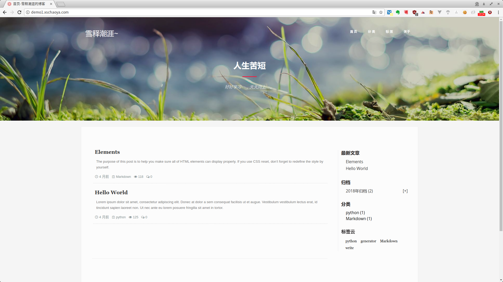

# blog-diango-bootstrap

 一个采用[Django](https://www.djangoproject.com)+[Bootstrap](http://www.bootcss.com/)+[MySQL](https://www.mysql.com/) 写的[博客系统](http://demo1.xschaoya.com)





## 安装
1. 克隆项目

    ```git
    $ git clone https://github.com/xueshichaoya/hexo-theme-dandelion.git　themes/dandelion
    ```

2. 执行(python3)

    ```sh
    pip install -r requirements.txt
    python manage.py makemigrations
    python manage.py migrate
    数据库请参考官方文档配置
    ```

## License
MIT
